= AT Core Server API Reference
v1.0, 2020-12-25
:toc:
:toclevels: 4
:toc-title: 目次

[[team.proto]]

== team.proto

Team はチームに関する情報を操作します。

=== Messages

[[at_core_service.Team]]

==== Team

チームを表します。

[%autowidth.stretch]
|===
| Field | Type | Label | Description

| team_id
| <<int64,int64>>
| 
| チームID。
| name
| <<string,string>>
| 
| チーム名。

// end range fields
|===

// end if has fields

// end if has extensions

[[at_core_service.TeamCreateRequest]]

==== TeamCreateRequest

チームの作成要求を表します。

[%autowidth.stretch]
|===
| Field | Type | Label | Description

| name
| <<string,string>>
| 
| チーム名。

// end range fields
|===

// end if has fields

// end if has extensions

[[at_core_service.TeamListRequest]]

==== TeamListRequest

チームのリストを取得する際のリクエストを表します。

// end if has fields

// end if has extensions

[[at_core_service.TeamRequest]]

==== TeamRequest

チームを取得する際のリクエストを表します。

[%autowidth.stretch]
|===
| Field | Type | Label | Description

| team_id
| <<int64,int64>>
| 
| チームID。

// end range fields
|===

// end if has fields

// end if has extensions

[[at_core_service.TeamUpdateRequest]]

==== TeamUpdateRequest

チームの更新要求を表します。

[%autowidth.stretch]
|===
| Field | Type | Label | Description

| team_id
| <<int64,int64>>
| 
| チームID。
| name
| <<string,string>>
| 
| チーム名。

// end range fields
|===

// end if has fields

// end if has extensions

[[at_core_service.Teams]]

==== Teams

チームのリストを表します。

[%autowidth.stretch]
|===
| Field | Type | Label | Description

| teams
| <<at_core_service.Team,Team>>
| repeated
| チームのリスト。

// end range fields
|===

// end if has fields

// end if has extensions

// end range messages

// end if has messages

// end if has enums

// end if has extensions

=== Services

[[at_core_service.TeamService]]

==== TeamService

チームを操作するAPIを提供します。

[%autowidth.stretch]
|===
| Method Name | Request Type | Response Type | Description

| List
| <<at_core_service.TeamListRequest,TeamListRequest>>
| <<at_core_service.Teams,Teams>>
a| チームを取得します。 TeamListRequest を渡します。 チームのリストが設定された Teams が返ります。
| Get
| <<at_core_service.TeamRequest,TeamRequest>>
| <<at_core_service.Team,Team>>
a| チームを取得します。 取得するチームのチームIDを指定した TeamRequest を渡します。 チームが存在する場合、Team が返ります。
| Create
| <<at_core_service.TeamCreateRequest,TeamCreateRequest>>
| <<at_core_service.Team,Team>>
a| 新しくチームを作成します。 チーム名を指定した TeamCreateRequest を渡します。 チームの作成に成功すると、チームIDが設定さた Team が返ります。
| Update
| <<at_core_service.TeamUpdateRequest,TeamUpdateRequest>>
| <<at_core_service.Team,Team>>
a| チームを更新します。 更新するチームのチームIDと、新しいチーム名を指定した TeamUpdateRequest を渡します。 チームの作成に成功すると、Team が返ります。
| Delete
| <<at_core_service.TeamRequest,TeamRequest>>
| <<google.protobuf.Empty,.google.protobuf.Empty>>
a| チームを削除します。 削除するチームのチームIDを指定した TeamRequest を渡します。

// end range methods
|===

// end range services

// end if has services

[[room.proto]]

== room.proto

Room はルームに関する情報を操作します。

=== Messages

[[at_core_service.Room]]

==== Room

ルームを表します。

[%autowidth.stretch]
|===
| Field | Type | Label | Description

| team_id
| <<int64,int64>>
| 
| チームID。
| room_id
| <<int64,int64>>
| 
| ルームID。
| name
| <<string,string>>
| 
| ルーム名。
| device_id
| <<int64,int64>>
| 
| デバイスID。
| device_name
| <<string,string>>
| 
| デバイス名。

// end range fields
|===

// end if has fields

// end if has extensions

[[at_core_service.RoomCreateRequest]]

==== RoomCreateRequest

ルームの作成要求を表します。

[%autowidth.stretch]
|===
| Field | Type | Label | Description

| team_id
| <<int64,int64>>
| 
| チームID。
| name
| <<string,string>>
| 
| ルーム名。

// end range fields
|===

// end if has fields

// end if has extensions

[[at_core_service.RoomDeviceRequest]]

==== RoomDeviceRequest

ルームへのデバイス設定要求を表します。

[%autowidth.stretch]
|===
| Field | Type | Label | Description

| team_id
| <<int64,int64>>
| 
| チームID。
| room_id
| <<int64,int64>>
| 
| ルームID。
| device_id
| <<int64,int64>>
| 
| デバイスID。
| force
| <<bool,bool>>
| 
| 強制的にデバイスを設定するかどうか。True の場合、他のルームに既に設定されているデバイスであっても、登録します。(optional)

// end range fields
|===

// end if has fields

// end if has extensions

[[at_core_service.RoomListRequest]]

==== RoomListRequest

ルームのリストを取得する際のリクエストを表します。

[%autowidth.stretch]
|===
| Field | Type | Label | Description

| team_id
| <<int64,int64>>
| 
| チームID。

// end range fields
|===

// end if has fields

// end if has extensions

[[at_core_service.RoomRequest]]

==== RoomRequest

ルームを取得する際のリクエストを表します。

[%autowidth.stretch]
|===
| Field | Type | Label | Description

| team_id
| <<int64,int64>>
| 
| チームID。
| room_id
| <<int64,int64>>
| 
| ルームID。

// end range fields
|===

// end if has fields

// end if has extensions

[[at_core_service.RoomUpdateRequest]]

==== RoomUpdateRequest

ルームの更新要求を表します。

[%autowidth.stretch]
|===
| Field | Type | Label | Description

| team_id
| <<int64,int64>>
| 
| チームID。
| room_id
| <<int64,int64>>
| 
| ルームID。
| name
| <<string,string>>
| 
| ルーム名。

// end range fields
|===

// end if has fields

// end if has extensions

[[at_core_service.Rooms]]

==== Rooms

ルームのリストを表します。

[%autowidth.stretch]
|===
| Field | Type | Label | Description

| rooms
| <<at_core_service.Room,Room>>
| repeated
| ルームのリスト。

// end range fields
|===

// end if has fields

// end if has extensions

// end range messages

// end if has messages

// end if has enums

// end if has extensions

=== Services

[[at_core_service.RoomService]]

==== RoomService

ルームを操作するAPIを提供します。

[%autowidth.stretch]
|===
| Method Name | Request Type | Response Type | Description

| List
| <<at_core_service.RoomListRequest,RoomListRequest>>
| <<at_core_service.Rooms,Rooms>>
a| ルームを取得します。 取得するルームのチームIDを指定した RoomListRequest を渡します。 指定されたチームIDのルームのリストが設定された Rooms が返ります。
| Get
| <<at_core_service.RoomRequest,RoomRequest>>
| <<at_core_service.Room,Room>>
a| ルームを取得します。 取得するルームのルームIDを指定した RoomRequest を渡します。 ルームが存在する場合、Room が返ります。
| Create
| <<at_core_service.RoomCreateRequest,RoomCreateRequest>>
| <<at_core_service.Room,Room>>
a| 新しくルームを作成します。 ルーム名とチームIDを指定した RoomCreateRequest を渡します。 ルームの作成に成功すると、ルームIDが設定さた Room が返ります。
| Update
| <<at_core_service.RoomUpdateRequest,RoomUpdateRequest>>
| <<at_core_service.Room,Room>>
a| ルームを更新します。 更新するルームのルームIDと、新しいルーム名を指定した RoomUpdateRequest を渡します。 ルームの作成に成功すると、Room が返ります。
| SetDevice
| <<at_core_service.RoomDeviceRequest,RoomDeviceRequest>>
| <<at_core_service.Room,Room>>
a| ルームにカスタマーデバイスを設定します。 設定するルームのルームIDと、設定するカスタマーデバイスのデバイスIDを指定した RoomDeviceRequest を渡します。 RoomDeviceRequest の force に True を指定すると、他のルームに既に設定されているデバイスであっても、設定します。 カスタマーデバイスの設定に成功すると、Room が返ります。
| DeleteDevice
| <<at_core_service.RoomRequest,RoomRequest>>
| <<at_core_service.Room,Room>>
a| ルームに設定されたカスタマーデバイスを削除します。 カスタマーデバイスを削除するルームのルームIDを指定した RoomRequest を渡します。 カスタマーデバイスの削除に成功すると、Room が返ります。
| Delete
| <<at_core_service.RoomRequest,RoomRequest>>
| <<google.protobuf.Empty,.google.protobuf.Empty>>
a| ルームを削除します。 削除するルームのルームIDを指定した RoomRequest を渡します。

// end range methods
|===

// end range services

// end if has services

[[device.proto]]

== device.proto

Device はデバイスに関する情報を操作します。

=== Messages

[[at_core_service.Device]]

==== Device

デバイスを表します。

[%autowidth.stretch]
|===
| Field | Type | Label | Description

| team_id
| <<int64,int64>>
| 
| チームID。
| device_id
| <<int64,int64>>
| 
| デバイスID。
| name
| <<string,string>>
| 
| デバイス名。
| type
| <<at_core_service.DeviceType,DeviceType>>
| 
| デバイスのタイプ。
| room_id
| <<int64,int64>>
| 
| デバイスが登録されているルームID。デバイスのタイプがカスタマーの場合のみ設定。

// end range fields
|===

// end if has fields

// end if has extensions

[[at_core_service.DeviceListByTypeRequest]]

==== DeviceListByTypeRequest

デバイスタイプを指定したデバイスのリストを取得する際のリクエストを表します。

[%autowidth.stretch]
|===
| Field | Type | Label | Description

| team_id
| <<int64,int64>>
| 
| チームID。
| type
| <<at_core_service.DeviceType,DeviceType>>
| 
| デバイスのタイプ。

// end range fields
|===

// end if has fields

// end if has extensions

[[at_core_service.DeviceListRequest]]

==== DeviceListRequest

デバイスのリストを取得する際のリクエストを表します。

[%autowidth.stretch]
|===
| Field | Type | Label | Description

| team_id
| <<int64,int64>>
| 
| チームID。

// end range fields
|===

// end if has fields

// end if has extensions

[[at_core_service.DeviceRegistrationRequest]]

==== DeviceRegistrationRequest

デバイスの登録要求を表します。

[%autowidth.stretch]
|===
| Field | Type | Label | Description

| team_id
| <<int64,int64>>
| 
| チームID。
| name
| <<string,string>>
| 
| デバイス名。
| otp
| <<int32,int32>>
| 
| ワンタイムパスワード。

// end range fields
|===

// end if has fields

// end if has extensions

[[at_core_service.DeviceRequest]]

==== DeviceRequest

デバイスを取得する際のリクエストを表します。

[%autowidth.stretch]
|===
| Field | Type | Label | Description

| team_id
| <<int64,int64>>
| 
| チームID。
| device_id
| <<int64,int64>>
| 
| デバイスID。

// end range fields
|===

// end if has fields

// end if has extensions

[[at_core_service.DeviceUpdateRequest]]

==== DeviceUpdateRequest

デバイスの更新要求を表します。

[%autowidth.stretch]
|===
| Field | Type | Label | Description

| team_id
| <<int64,int64>>
| 
| チームID。
| device_id
| <<int64,int64>>
| 
| デバイスID。
| name
| <<string,string>>
| 
| デバイス名。

// end range fields
|===

// end if has fields

// end if has extensions

[[at_core_service.Devices]]

==== Devices

デバイスのリストを表します。

[%autowidth.stretch]
|===
| Field | Type | Label | Description

| devices
| <<at_core_service.Device,Device>>
| repeated
| デバイスのリスト。

// end range fields
|===

// end if has fields

// end if has extensions

// end range messages

// end if has messages

=== Enums

[[at_core_service.DeviceType]]

==== DeviceType

デバイスのタイプを表します。

[%autowidth.stretch]
|===
| Name | Number | Description

| DEVICE_TYPE_OPERATOR
| 0
| オペレーターデバイスを表します。
| DEVICE_TYPE_CUSTOMER
| 1
| カスタマーデバイスを表します。

// end range values
|===

// end range enums

// end if has enums

// end if has extensions

=== Services

[[at_core_service.DeviceService]]

==== DeviceService

デバイスを操作するAPIを提供します。

[%autowidth.stretch]
|===
| Method Name | Request Type | Response Type | Description

| List
| <<at_core_service.DeviceListRequest,DeviceListRequest>>
| <<at_core_service.Devices,Devices>>
a| デバイスのリストを取得します。 取得するデバイスのチームIDを指定した DeviceListRequest を渡します。 指定されたチームIDのデバイスのリストが設定された Devices が返ります。
| ListByType
| <<at_core_service.DeviceListByTypeRequest,DeviceListByTypeRequest>>
| <<at_core_service.Devices,Devices>>
a| 指定されたデバイスタイプのデバイスのリストを取得します。 取得するデバイスのチームIDとデバイスタイプを指定した DeviceListByTypeRequest を渡します。 指定されたチームIDのデバイスのリストが設定された Devices が返ります。
| Get
| <<at_core_service.DeviceRequest,DeviceRequest>>
| <<at_core_service.Device,Device>>
a| デバイスを取得します。 取得するデバイスのデバイスIDを指定した DeviceRequest を渡します。 デバイスが存在する場合、Device が返ります。
| Register
| <<at_core_service.DeviceRegistrationRequest,DeviceRegistrationRequest>>
| <<at_core_service.Device,Device>>
a| 新しくデバイスを登録します。 チームID、デバイス名、ワンタイムパスワードを指定した DeviceRegistrationRequest を渡します。 デバイスの作成に成功すると、デバイスID、デバイスタイプが設定さた Device が返ります。
| Update
| <<at_core_service.DeviceUpdateRequest,DeviceUpdateRequest>>
| <<at_core_service.Device,Device>>
a| デバイスを更新します。 更新するデバイスのデバイスIDと、新しいデバイス名を指定した DeviceUpdateRequest を渡します。 デバイスの作成に成功すると、Device が返ります。
| Delete
| <<at_core_service.DeviceRequest,DeviceRequest>>
| <<google.protobuf.Empty,.google.protobuf.Empty>>
a| デバイスを削除します。 削除するデバイスのデバイスIDを指定した DeviceRequest を渡します。

// end range methods
|===

// end range services

// end if has services

[[content.proto]]

== content.proto

Content はコンテンツに関する情報を操作します。

=== Messages

[[at_core_service.Content]]

==== Content

コンテンツを表します。

[%autowidth.stretch]
|===
| Field | Type | Label | Description

| team_id
| <<int64,int64>>
| 
| チームID。
| content_id
| <<int64,int64>>
| 
| コンテンツID。
| name
| <<string,string>>
| 
| コンテンツ名。
| type
| <<at_core_service.ContentType,ContentType>>
| 
| コンテンツタイプ。
| size
| <<int64,int64>>
| 
| コンテンツのサイズ。
| mime_type
| <<string,string>>
| 
| コンテンツのMIMEタイプ。
| md5
| <<bytes,bytes>>
| 
| MD5ハッシュ。

// end range fields
|===

// end if has fields

// end if has extensions

[[at_core_service.ContentListByTypeRequest]]

==== ContentListByTypeRequest

コンテンツタイプを指定したコンテンツのリストを取得する際のリクエストを表します。

[%autowidth.stretch]
|===
| Field | Type | Label | Description

| team_id
| <<int64,int64>>
| 
| チームID。
| type
| <<at_core_service.ContentType,ContentType>>
| 
| コンテンツのタイプ。

// end range fields
|===

// end if has fields

// end if has extensions

[[at_core_service.ContentListRequest]]

==== ContentListRequest

コンテンツのリストを取得する際のリクエストを表します。

[%autowidth.stretch]
|===
| Field | Type | Label | Description

| team_id
| <<int64,int64>>
| 
| チームID。

// end range fields
|===

// end if has fields

// end if has extensions

[[at_core_service.ContentRequest]]

==== ContentRequest

コンテンツを取得する際のリクエストを表します。

[%autowidth.stretch]
|===
| Field | Type | Label | Description

| team_id
| <<int64,int64>>
| 
| チームID。
| content_id
| <<int64,int64>>
| 
| コンテンツID。

// end range fields
|===

// end if has fields

// end if has extensions

[[at_core_service.ContentUpdateRequest]]

==== ContentUpdateRequest

コンテンツの更新要求を表します。

[%autowidth.stretch]
|===
| Field | Type | Label | Description

| team_id
| <<int64,int64>>
| 
| チームID。
| content_id
| <<int64,int64>>
| 
| コンテンツID。
| name
| <<string,string>>
| 
| コンテンツ名。

// end range fields
|===

// end if has fields

// end if has extensions

[[at_core_service.ContentUploadRequest]]

==== ContentUploadRequest

コンテンツのアップロード要求を表します。

[%autowidth.stretch]
|===
| Field | Type | Label | Description

| team_id
| <<int64,int64>>
| 
| チームID。
| name
| <<string,string>>
| 
| コンテンツ名。
| type
| <<at_core_service.ContentType,ContentType>>
| 
| コンテンツタイプ。
| file_name
| <<string,string>>
| 
| コンテンツのファイル名。

// end range fields
|===

// end if has fields

// end if has extensions

[[at_core_service.ContentUploadURL]]

==== ContentUploadURL

コンテンツをアップロードするためのURLを表します。

[%autowidth.stretch]
|===
| Field | Type | Label | Description

| content_id
| <<int64,int64>>
| 
| コンテンツID。
| url
| <<string,string>>
| 
| コンテンツをアップロードするURL。

// end range fields
|===

// end if has fields

// end if has extensions

[[at_core_service.Contents]]

==== Contents

コンテンツのリストを表します。

[%autowidth.stretch]
|===
| Field | Type | Label | Description

| contents
| <<at_core_service.Content,Content>>
| repeated
| コンテンツのリスト。

// end range fields
|===

// end if has fields

// end if has extensions

[[at_core_service.FinishUploadRequest]]

==== FinishUploadRequest

コンテンツをアップロード終了要求を表します。

[%autowidth.stretch]
|===
| Field | Type | Label | Description

| team_id
| <<int64,int64>>
| 
| チームID。
| content_id
| <<int64,int64>>
| 
| コンテンツID。
| md5
| <<bytes,bytes>>
| 
| MD5ハッシュ。

// end range fields
|===

// end if has fields

// end if has extensions

// end range messages

// end if has messages

=== Enums

[[at_core_service.ContentType]]

==== ContentType

コンテンツのタイプを表します。

[%autowidth.stretch]
|===
| Name | Number | Description

| CONTENT_TYPE_IMAGE
| 0
| 画像コンテンツ。
| CONTENT_TYPE_VIDEO
| 1
| ビデオコンテンツ。
| CONTENT_TYPE_ASSET
| 2
| アセットコンテンツ。
| CONTENT_TYPE_OTHER
| 999
| その他のコンテンツ。

// end range values
|===

// end range enums

// end if has enums

// end if has extensions

=== Services

[[at_core_service.ContentService]]

==== ContentService

コンテンツを操作するAPIを提供します。

[%autowidth.stretch]
|===
| Method Name | Request Type | Response Type | Description

| List
| <<at_core_service.ContentListRequest,ContentListRequest>>
| <<at_core_service.Contents,Contents>>
a| コンテンツのリストを取得します。 取得するコンテンツのチームIDを指定した ContentListRequest を渡します。 指定されたチームIDのコンテンツのリストが設定された Contents が返ります。
| ListContentType
| <<at_core_service.ContentListByTypeRequest,ContentListByTypeRequest>>
| <<at_core_service.Contents,Contents>>
a| 指定されたコンテンツタイプのコンテンツのリストを取得します。 取得するコンテンツのチームIDとコンテンツタイプを指定した ContentListByTypeRequest を渡します。 指定されたチームIDとコンテンツタイプのコンテンツのリストが設定された Contents が返ります。
| Get
| <<at_core_service.ContentRequest,ContentRequest>>
| <<at_core_service.Content,Content>>
a| コンテンツを取得します。 取得するコンテンツのコンテンツIDを指定した ContentRequest を渡します。 コンテンツが存在する場合、Content が返ります。
| Upload
| <<at_core_service.ContentUploadRequest,ContentUploadRequest>>
| <<at_core_service.ContentUploadURL,ContentUploadURL>>
a| コンテンツをアップロードします。 チームID、アップロードするコンテンツのコンテンツ名とコンテンツタイプを指定した ContentUploadRequest を渡します。 アップロードを行うための URL が設定された ContentUploadURL が返ります。 このURLにコンテンツデータをHTTP POSTメソッドで転送することで、アップロードが行われます。 アップロード完了後、FinishUpload メソッドでアップロードの完了を登録します。
| FinishUpload
| <<at_core_service.FinishUploadRequest,FinishUploadRequest>>
| <<at_core_service.Content,Content>>
a| コンテンツのアップロード完了を登録します。 チームID、コンテンツID、アップロードしたコンテンツのMD5ハッシュを指定した FinishUploadRequest を渡します。 登録に成功すると Content が返ります。
| Update
| <<at_core_service.ContentUpdateRequest,ContentUpdateRequest>>
| <<at_core_service.Content,Content>>
a| コンテンツを更新します。 更新するコンテンツのコンテンツIDと、新しいコンテンツ名を指定した ContentUpdateRequest を渡します。 コンテンツの作成に成功すると、Content が返ります。
| Delete
| <<at_core_service.ContentRequest,ContentRequest>>
| <<google.protobuf.Empty,.google.protobuf.Empty>>
a| コンテンツを削除します。 削除するコンテンツのコンテンツIDを指定した ContentRequest を渡します。

// end range methods
|===

// end range services

// end if has services

[[dashboard.proto]]

== dashboard.proto

Dashboard はダッシュボードに関する情報を操作します。

=== Messages

[[at_core_service.Dashboard]]

==== Dashboard

ダッシュボードの情報を表します。

[%autowidth.stretch]
|===
| Field | Type | Label | Description

| rooms
| <<at_core_service.Room,Room>>
| repeated
| ルームのリスト。
| room_states
| <<at_core_service.RoomState,RoomState>>
| repeated
| ルーム状態のリスト。
| contents
| <<at_core_service.DashboardContent,DashboardContent>>
| repeated
| コンテンツのリスト。

// end range fields
|===

// end if has fields

// end if has extensions

[[at_core_service.DashboardContent]]

==== DashboardContent

ダッシュボードのコンテンツを表します。

[%autowidth.stretch]
|===
| Field | Type | Label | Description

| content_id
| <<int64,int64>>
| 
| コンテンツID。
| name
| <<string,string>>
| 
| コンテンツ名。
| type
| <<at_core_service.ContentType,ContentType>>
| 
| コンテンツタイプ。

// end range fields
|===

// end if has fields

// end if has extensions

[[at_core_service.DashboardEvent]]

==== DashboardEvent

ダッシュボードのイベントを表します。

[%autowidth.stretch]
|===
| Field | Type | Label | Description

| type
| <<at_core_service.DashboardEventType,DashboardEventType>>
| 
| イベントタイプ
| room_state
| <<at_core_service.RoomState,RoomState>>
| 
| 入室または退室したルームの状態。

// end range fields
|===

// end if has fields

// end if has extensions

[[at_core_service.DashboardRequest]]

==== DashboardRequest

ダッシュボードを取得する際のリクエストを表します。

[%autowidth.stretch]
|===
| Field | Type | Label | Description

| team_id
| <<int64,int64>>
| 
| チームID。

// end range fields
|===

// end if has fields

// end if has extensions

[[at_core_service.JoinRoomRequest]]

==== JoinRoomRequest

ルームの入室リクエストを表します。

[%autowidth.stretch]
|===
| Field | Type | Label | Description

| team_id
| <<int64,int64>>
| 
| チームID。
| room_id
| <<int64,int64>>
| 
| 入室するルームのルームID。
| device_id
| <<int64,int64>>
| 
| 入室するオペレーターデバイスのデバイスID。
| force
| <<bool,bool>>
| 
| 既に入室しているデバイスがある場合に、強制的に入室するかどうか。True の場合、既に入室しているデバイスを強制的に退室させ、入室を行います。(optional)

// end range fields
|===

// end if has fields

// end if has extensions

[[at_core_service.LeaveRoomRequest]]

==== LeaveRoomRequest

ルームの退室リクエストを表します。

[%autowidth.stretch]
|===
| Field | Type | Label | Description

| team_id
| <<int64,int64>>
| 
| チームID。
| room_id
| <<int64,int64>>
| 
| 退室するルームのルームID。
| device_id
| <<int64,int64>>
| 
| 退室するオペレーターデバイスのデバイスID。

// end range fields
|===

// end if has fields

// end if has extensions

[[at_core_service.OperatorDevice]]

==== OperatorDevice

オペレーターのデバイスを表します。

[%autowidth.stretch]
|===
| Field | Type | Label | Description

| device_id
| <<int64,int64>>
| 
| デバイスID。

// end range fields
|===

// end if has fields

// end if has extensions

[[at_core_service.PlayContentRequest]]

==== PlayContentRequest

コンテンツ再生のリクエストを表します。

[%autowidth.stretch]
|===
| Field | Type | Label | Description

| team_id
| <<int64,int64>>
| 
| チームID。
| device_id
| <<int64,int64>>
| 
| コンテンツを再生するルームに入室しているデバイスのデバイスID。
| content_id
| <<int64,int64>>
| 
| 再生するコンテンツのコンテンツID。

// end range fields
|===

// end if has fields

// end if has extensions

[[at_core_service.RoomState]]

==== RoomState

ルームの状態を表します。

[%autowidth.stretch]
|===
| Field | Type | Label | Description

| room_id
| <<int64,int64>>
| 
| ルームID。
| device_id
| <<int64,int64>>
| 
| ルームに登録されたデバイスのデバイスID。
| operators
| <<at_core_service.OperatorDevice,OperatorDevice>>
| repeated
| オペレーション中のオペレーターデバイスのリスト。

// end range fields
|===

// end if has fields

// end if has extensions

[[at_core_service.StopContentRequest]]

==== StopContentRequest

コンテンツ停止のリクエストを表します。

[%autowidth.stretch]
|===
| Field | Type | Label | Description

| team_id
| <<int64,int64>>
| 
| チームID。
| device_id
| <<int64,int64>>
| 
| コンテンツを停止するルームに入室しているデバイスのデバイスID。

// end range fields
|===

// end if has fields

// end if has extensions

[[at_core_service.VideoFrame]]

==== VideoFrame

ビデオストリームのビデオフレームを表します。

[%autowidth.stretch]
|===
| Field | Type | Label | Description

| type
| <<at_core_service.VideoFrameType,VideoFrameType>>
| 
| ビデオフレームのタイプ。
| payload
| <<bytes,bytes>>
| 
| ビデオフレームのペイロード。

// end range fields
|===

// end if has fields

// end if has extensions

[[at_core_service.VideoStreamRequest]]

==== VideoStreamRequest

ビデオストリームを取得するリクエストを表します。

[%autowidth.stretch]
|===
| Field | Type | Label | Description

| team_id
| <<int64,int64>>
| 
| チームID。
| room_id
| <<int64,int64>>
| 
| ストリームを取得するルームのルームID。

// end range fields
|===

// end if has fields

// end if has extensions

// end range messages

// end if has messages

=== Enums

[[at_core_service.DashboardEventType]]

==== DashboardEventType

ダッシュボードのイベントのイベントタイプを表します。

[%autowidth.stretch]
|===
| Name | Number | Description

| NO_EVENT
| 0
| なにもないイベント。
| JOIN_ROOM
| 1
| 何れかのオペレーターがルームに入室した。
| LEAVE_ROOM
| 2
| 何れかのオペレーターがルームから退室した。

// end range values
|===

[[at_core_service.VideoFrameType]]

==== VideoFrameType

ビデオフレームのタイプを表します。

[%autowidth.stretch]
|===
| Name | Number | Description

| VIDEO_FRAME_UNKOWN
| 0
| 不明なフレーム
| VIDEO_FRAME_JPEG
| 1
| JPEG フレーム。

// end range values
|===

// end range enums

// end if has enums

// end if has extensions

=== Services

[[at_core_service.DashboardService]]

==== DashboardService

ダッシュボードを操作するAPIを提供します。

[%autowidth.stretch]
|===
| Method Name | Request Type | Response Type | Description

| Get
| <<at_core_service.DashboardRequest,DashboardRequest>>
| <<at_core_service.Dashboard,Dashboard>>
a| ダッシュボード情報を取得します。 取得するダッシュボードのチームIDを指定した DashboardRequest を渡します。 ダッシュボード情報を設定した Dashboard が返ります。
| EventStream
| <<at_core_service.DashboardRequest,DashboardRequest>>
| <<at_core_service.DashboardEvent,DashboardEvent>> stream
a| ダッシュボードのイベントを取得します。 取得するダッシュボードイベントのチームIDを指定した DashboardRequest を渡します。 イベントが発生する度に、イベントデータを設定した DashboardEvent が返ります。
| JoinRoom
| <<at_core_service.JoinRoomRequest,JoinRoomRequest>>
| <<at_core_service.RoomState,RoomState>>
a| ルームに入室します。 入室するオエペレーターのデバイスIDとルームIDを指定した JoinRoomRequest を渡します。 JoinRoomRequest の force に True を指定すると、既に入室しているデバイスを強制的に退室させ、入室を行います。 入室したルームのルーム状態を設定した RoomState が返ります。
| LeaveRoom
| <<at_core_service.LeaveRoomRequest,LeaveRoomRequest>>
| <<at_core_service.RoomState,RoomState>>
a| ルームから退室します。 退室するオエペレーターのデバイスIDとルームIDを指定した LeaveRoomRequest を渡します。 退室したルームのルーム状態を設定した RoomState が返ります。
| PlayContent
| <<at_core_service.PlayContentRequest,PlayContentRequest>>
| <<google.protobuf.Empty,.google.protobuf.Empty>>
a| コンテンツを再生します。 コンテンツを再生するコンテンツIDとルームに入室しているデバイスのデバイスIDを設定した PlayContentRequest を渡します。
| StopContent
| <<at_core_service.StopContentRequest,StopContentRequest>>
| <<google.protobuf.Empty,.google.protobuf.Empty>>
a| コンテンツを停止します。 コンテンツを停止するルームに入室しているデバイスのデバイスIDを設定した StopContentRequest を渡します。
| VideoStream
| <<at_core_service.VideoStreamRequest,VideoStreamRequest>>
| <<at_core_service.VideoFrame,VideoFrame>> stream
a| ビデオストリームを取得します。 ビデオストリームを取得するルームのルームIDを指定した VideoStreamRequest を渡します。 各フレームを格納した VideoFrame が返ります。

// end range methods
|===

// end range services

// end if has services

// end range files

== シーケンス図

=== Team

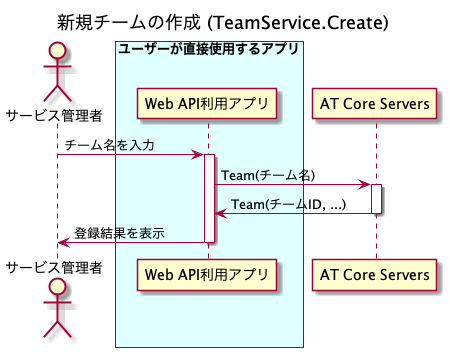
 
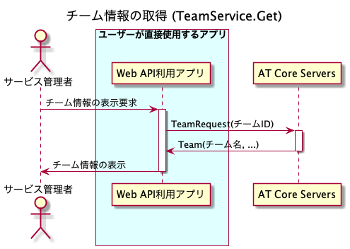
 
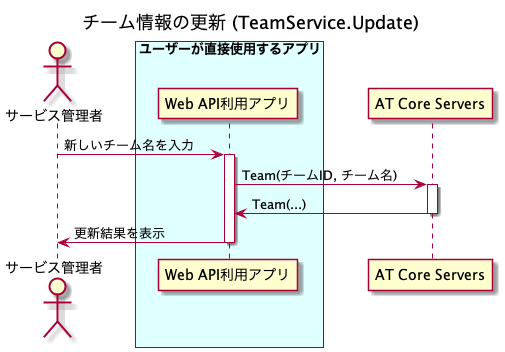
 
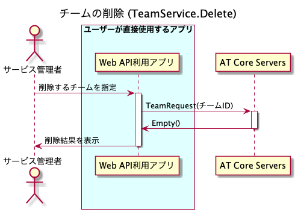

=== Room

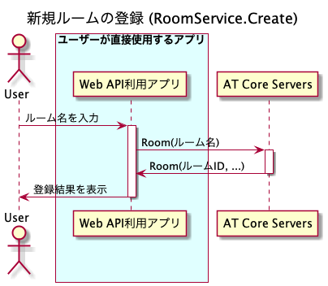
 
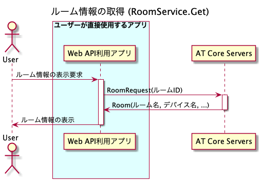
 
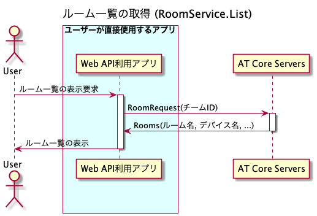
 
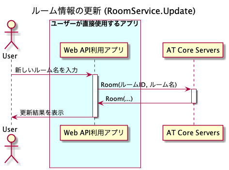

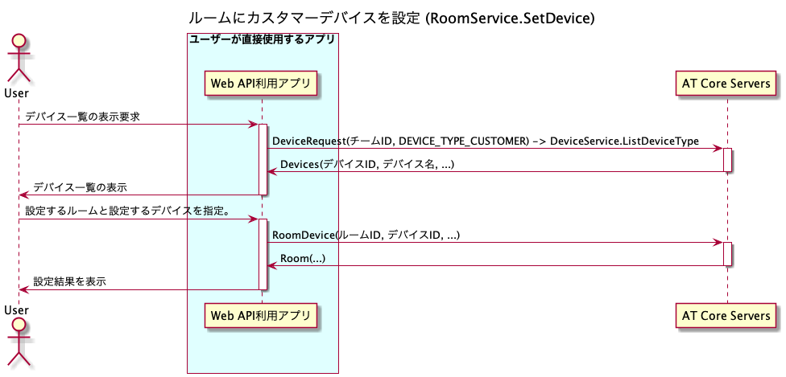
 
image::images/room_delete.png[RoomService.Delete]

=== Device

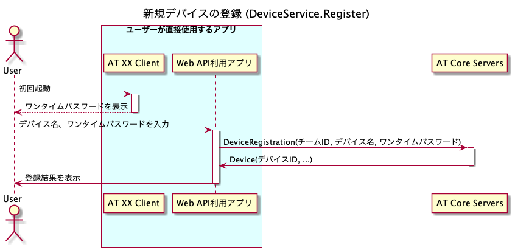
 

 
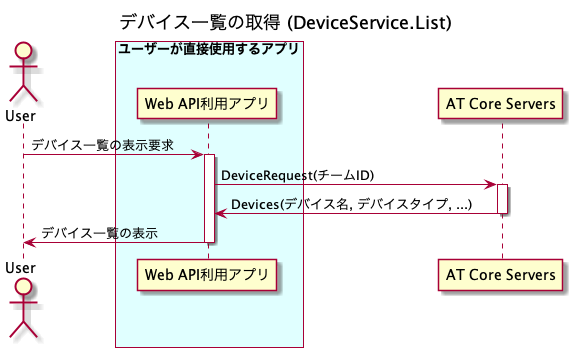
 
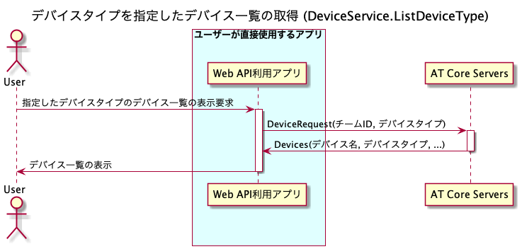
 
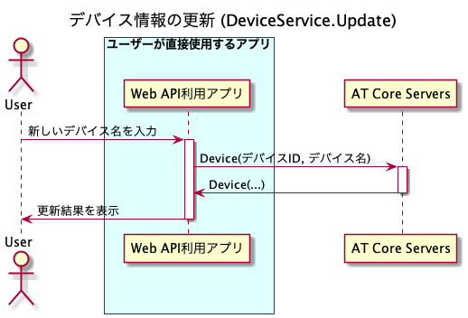
 
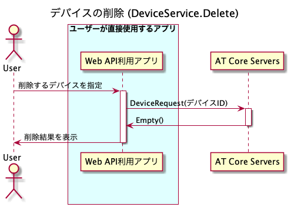

=== Content

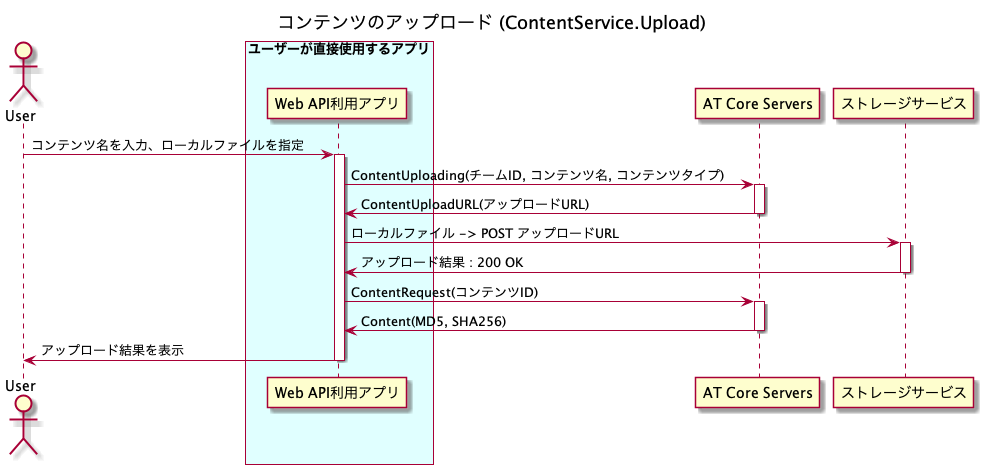
 
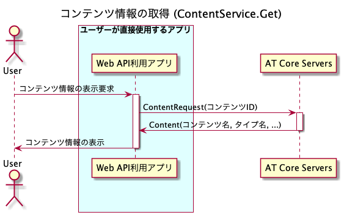
 
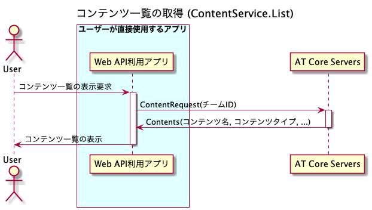
 
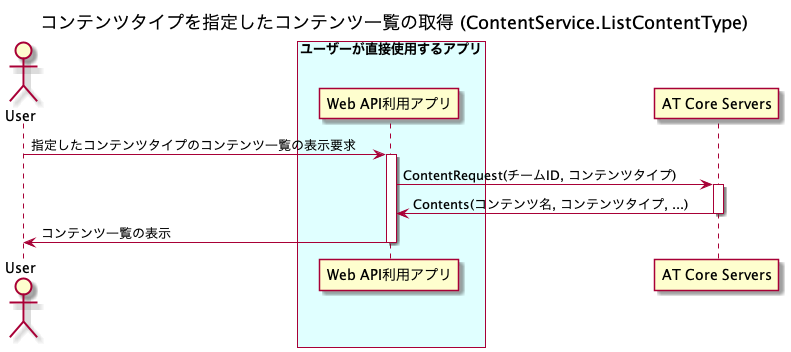
 
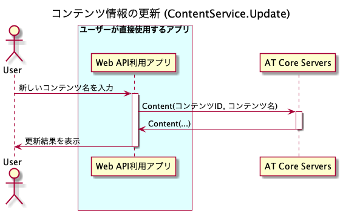
 

== Scalar Value Types

[%autowidth.stretch]
|===
| .proto Type | Notes | C++ | Java | Python | Go | C# | PHP | Ruby

| [[double]] double
| 
| double
| double
| float
| float64
| double
| float
| Float
| [[float]] float
| 
| float
| float
| float
| float32
| float
| float
| Float
| [[int32]] int32
| Uses variable-length encoding. Inefficient for encoding negative numbers – if your field is likely to have negative values, use sint32 instead.
| int32
| int
| int
| int32
| int
| integer
| Bignum or Fixnum (as required)
| [[int64]] int64
| Uses variable-length encoding. Inefficient for encoding negative numbers – if your field is likely to have negative values, use sint64 instead.
| int64
| long
| int/long
| int64
| long
| integer/string
| Bignum
| [[uint32]] uint32
| Uses variable-length encoding.
| uint32
| int
| int/long
| uint32
| uint
| integer
| Bignum or Fixnum (as required)
| [[uint64]] uint64
| Uses variable-length encoding.
| uint64
| long
| int/long
| uint64
| ulong
| integer/string
| Bignum or Fixnum (as required)
| [[sint32]] sint32
| Uses variable-length encoding. Signed int value. These more efficiently encode negative numbers than regular int32s.
| int32
| int
| int
| int32
| int
| integer
| Bignum or Fixnum (as required)
| [[sint64]] sint64
| Uses variable-length encoding. Signed int value. These more efficiently encode negative numbers than regular int64s.
| int64
| long
| int/long
| int64
| long
| integer/string
| Bignum
| [[fixed32]] fixed32
| Always four bytes. More efficient than uint32 if values are often greater than 2^28.
| uint32
| int
| int
| uint32
| uint
| integer
| Bignum or Fixnum (as required)
| [[fixed64]] fixed64
| Always eight bytes. More efficient than uint64 if values are often greater than 2^56.
| uint64
| long
| int/long
| uint64
| ulong
| integer/string
| Bignum
| [[sfixed32]] sfixed32
| Always four bytes.
| int32
| int
| int
| int32
| int
| integer
| Bignum or Fixnum (as required)
| [[sfixed64]] sfixed64
| Always eight bytes.
| int64
| long
| int/long
| int64
| long
| integer/string
| Bignum
| [[bool]] bool
| 
| bool
| boolean
| boolean
| bool
| bool
| boolean
| TrueClass/FalseClass
| [[string]] string
| A string must always contain UTF-8 encoded or 7-bit ASCII text.
| string
| String
| str/unicode
| string
| string
| string
| String (UTF-8)
| [[bytes]] bytes
| May contain any arbitrary sequence of bytes.
| string
| ByteString
| str
| []byte
| ByteString
| string
| String (ASCII-8BIT)

// end range scalars
|===

== 改訂履歴

* v1.0, 2020-12-25  Release Candidate 1
* v0.2, 2020-10-20  Closed Alpha2
