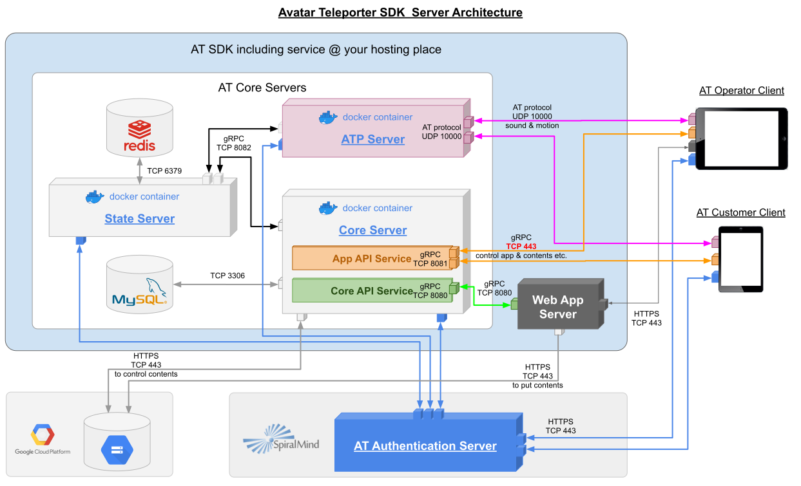

= Avatar Teleporter SDK サーバー

== AT SDK サーバー概要

Avatar Teleporter のサーバーは、Core サーバー、State サーバー、ATP サーバーの3つのサーバーと、MySQL や Redis などのデータベースで構成されます。

これらのサーバーアプリケーションは、Docker イメージとして提供します。
データベースについては、Docker イメージの使用は任意です。

AT サーバーの動作や、サーバーイメージの取得には、Google Cloud Platform のアカウントが必須ですので、事前にアカウントの用意をお願いします。

== AT SDK サーバー Docker イメージ

=== AT SDK サーバー Docker イメージについて
AT SDK の各サーバーアプリケーションの Docker イメージは、Google Container Registry (GCR) にて提供しています。

各イメージは以下の通りです。

.AT SDK サーバー Docker イメージ
|===
| サーバー名 | Docker イメージ名

| Core サーバー
| asia.gcr.io/at-sdk/at-core-server:1.0-rc1

| ATP サーバー 
| asia.gcr.io/at-sdk/at-atp-server:1.0-rc1

| State サーバー 
| asia.gcr.io/at-sdk/at-state-server:1.0-rc1

|===

各イメージには、バージョンごとにタグが付与されます。
`latest` タグを指定すると、最新のイメージが取得できますが、開発途中の安定していないバージョンが取得される可能性がありますので、厳密なバージョンを指定してイメージを取得してください。

=== Docker イメージの取得

Google Container Registry (GCR) からイメージの取得を行うには、アクセス権を付与した Google アカウントによって Docker を構成する必要があります。
Google アカウントへのアクセス権の付加については、SpiralMind の担当者にご連絡ください。

また、`docker pull` コマンドを使用してイメージを取得するために Docker を構成する必要があります。
アクセス権を付与した Google アカウントで `gcloud auth login` コマンドでログインを行なった後以下のコマンドを実行することで、Docker を構成することができます。

[source, console]
----
$ gcloud auth configure-docker asia.gcr.io
----

Docker の構成についての詳細は、以下を参照してください。

https://cloud.google.com/container-registry/docs/advanced-authentication

=== Docker イメージの実行

各 Docker イメージは、`docker run` コマンドや Docker Compose で実行することができます。
この時、Core サーバー及び ATP サーバーは、コンテナー外部からアクセスする必要があるので、ポートを公開する必要があります。
`docerk run` コマンドでポートを公開するには、`-p` オプションを使用します。

公開するポートについては、内部ポートとは別に任意のポートを公開することが可能です。

=== Docker Compose

Docker Compose を使用すると、必要なサーバー一式をまとめて起動することができます。

サンプルの link:../docker/docker-compose.yaml[`docker-compose.yaml`] を参考に、自身の環境に合わせて使用してください。

`docker-compose.yaml` が配置してあるディレクトリにて、以下を実行することで、ローカルで動作するサーバーを起動することができます。

[source, console]
----
$ mkdir -p data/redis data/mysql # データベースのデータ保存先のディレクトリを作成する
$ GCS_BUCKET_NAME=[バケット名] docker compose up
----

事前に、Google Cloud Storage の API アクセスの認証に使用するための証明書が格納された JSON ファイルを、`./credentials/gcs-credentials.json` に配置しておいてください。
詳細は、link:#google_cloud_storage[Google Cloud Storage] セクションを参照してください。

また、GCS のバケット名を、環境変数 `GCS_BUCKET_NAME` で指定します。

== 各サーバーについて

=== Core サーバー

==== Core サーバー概要

Core サーバーは、AT サービスの中核のサーバーです。
フロント Web サーバーからアクセスする API は、Core サーバーが提供します。
また、Core サーバーはクライアントアプリケーションが使用する API も提供します。

Core サーバーの起動には、State サーバーと MySQL、Google Cloud Storage が必要です。
Google Cloud Storage は、アップロードコンテンツの保存先になります。

Core サーバーを起動すると、Core API と App API で異る TCP ポートを Listen します。
Core API については、フロント Web サーバーのみ使用します。
セキュリティーのために、フロント Web サーバー以外からのアクセスを遮断するよう構成してください。
App API は、クライアントアプケーションが使用する API なので、外部からアクセスできるよう構成する必要があります。

==== Core サーバーの設定

Core サーバーの Docker イメージは、サーバーの設定を環境変数で指定することができます。

.Core サーバー設定
|===
| 環境変数名 | 初期値 | 説明

| CORE_SERVER_BIND_HOST
| 0.0.0.0
| Core サーバーの Core API サービスがバインドするホストを指定します。IP アドレスまたは名前解決可能なホスト名を指定します。

| CORE_SERVER_BIND_PORT
| 8080
| Core サーバーの Core API サービスがバインドするポートを指定します。

| CORE_SERVER_APP_BIND_HOST
| 0.0.0.0
| Core サーバーの App API サービスがバインドするホストを指定します。IP アドレスまたは名前解決可能なホスト名を指定します。

| CORE_SERVER_APP_BIND_PORT
| 8081
| Core サーバーの App API サービスがバインドするポートを指定します。

| MYSQL_HOST
| mysql
| MySQL サーバーのホストを指定します。

| MYSQL_PORT
| 3306
| MySQL サーバーのポートを指定します。

| MYSQL_USERNAME
| root
| MySQL のユーザー名を指定します。

| MYSQL_PASSWORD
|
| MySQL のパスワードを指定します。

| MYSQL_DATABASE
| avatar_teleporter
| MySQL のデータベースを指定します。

| STATE_SERVER_HOST
| state
| State サーバーのホストを指定します。

| STATE_SERVER_PORT
| 8082
| State サーバーのポートを指定します。

| STATE_SERVER_SECURE
| true
| Core サーバーから State サーバーに gRPC でアクセスする場合の、トランスポートセキュリティを有効にするオプションです。State サーバーの TLS が有効になっている場合はトランスポートセキュリティを有効にする必要があります。

| GCS_CREDENTIALS
| /app/gcs-credentials.json
| GCS の API にアクセスの認証に使用する、サービスアカウントの証明書を格納した JSON ファイルのパスを指定します。

| GCS_BUCKET_NAME
| avatar-teleporter
| GCS のバケット名を指定します。

|===

==== データベースのマイグレーション

Core サーバーの Docker イメージには、データベースのマイグレーションを行うための、マイグレーションツールが含まれます。

Core サーバーの Docker イメージは、デフォルトでサーバーアプリケーションが起動するようエントリーポイントが設定されています。
`docker run` コマンドのオプション `--entrypoint` でエントリーポイントを `/app/at-db-migration` コマンドに変更することで、マイグレーションを実行できます。
マイグレーションツールは、サーバーアプリケーションと同様の設定を使用します。

また、Core サーバーには、起動時にマイグレーションを行うオプションが存在します。
Core サーバーのコンテナーを起動する際に、コマンドとして `-migraion` オプションを付加すると、サーバー起動時にマイグレーションが実行されます。
実際に `docker run` コマンドでオプションを指定する場合は、`"-c", "config.toml", "-migrate"` と付加してください。

[[google_cloud_storage]]
==== Google Cloud Storage

Core サーバーがコンテンツファイルを保存するストレージとして、Google Cloud Storage (GCS) を使用します。
Google Cloud Platform にて、Google Cloud Storage を有効にし、コンテンツファイルを保存する Bucket を作成します。

また、GCS の API にアクセスするためには、GCS へのアクセスを行う権限が付与されたサービスアカウントが必要です。
サービスアカウントを作成すると、API アクセスの認証に使用するための証明書が格納された JSON ファイルをダウンロードできるようになります。

ダウンロードした JSON ファイルは、`docker run` こまんどの `-v` オプションを使用してホストのボリュームをコンテナー内にマウントすることで、コンテナー内部から JSON ファイルにアクセス可能になります。

また、Core サーバーの Docker コンテナーに環境変数にて Bucket 名を指定します。

=== State サーバー

==== State サーバー概要

State サーバーは、ルームやデバイスの状態を管理するサーバーです。
Core サーバー及び ATP サーバーは、State サーバーを介してルームやデバイスの状態の変更や状態の取得を行います。

State サーバーの起動には、Redis が必要です。
State サーバーが管理するルームやデバイスの状態は、Redis によって永続化されます。

==== State サーバーの設定

State サーバーの Docker イメージは、サーバーの設定を環境変数で指定することができます。

.State サーバーの設定
|===
| 環境変数名 | 初期値 | 説明

| STATE_SERVER_BIND_HOST
| 0.0.0.0
| State サーバーがバインドするホストを指定します。IP アドレスまたは名前解決可能なホスト名を指定します。

| STATE_SERVER_BIND_PORT
| 8082
| State サーバーがバインドするポートを指定します。

| REDIS_HOST
| redis
| Redis サーバーのホストを指定します。

| REDIS_PORT
| 6379
| Redis サーバーのポートを指定します。

| REDIS_PASSWORD
| 
| Redis のパスワードを指定します。

| REDIS_DB
| 0
| Redis のデータベースを指定します。

|===

=== ATP サーバー

==== ATP サーバー概要

ATP サーバーは、クライアントアプケーションから送信される音声データや表情データの転送を行うサーバーです。
State サーバーで管理されるルームやデバイスの状態をもとに、クライアントアプリケーション間のデータ転送の制御を行います。

Core サーバーの起動には、State サーバーが必要です。

ATP サーバーは、UDP による通信を行います。

==== ATP サーバーの設定

ATP サーバーの Docker イメージは、サーバーの設定を環境変数で指定することができます。

.ATP サーバーの設定
|===
| 環境変数名 | 初期値 | 説明

| ATP_SERVER_BIND_HOST
| 0.0.0.0
| ATP サーバーがバインドするホストを指定します。IP アドレスまたは名前解決可能なホスト名を指定します。

| ATP_SERVER_BIND_PORT
| 10000
| ATP サーバーがバインドするポートを指定します。

| ATP_SERVER_SERVER_HOST
| localhost
| クライアントアプリケーションが ATP サーバーにアクセスするためのホストを指定します。

| ATP_SERVER_SERVER_PORT
| 10000
| クライアントアプリケーションが ATP サーバーにアクセスするためのポートを指定します。

| STATE_SERVER_HOST
| state
| State サーバーのホストを指定します。

| STATE_SERVER_PORT
| 8082
| State サーバーのポートを指定します。

| STATE_SERVER_SECURE
| true
| Core サーバーから State サーバーに gRPC でアクセスする場合の、トランスポートセキュリティを有効にするオプションです。State サーバーの TLS が有効になっている場合はトランスポートセキュリティを有効にする必要があります。

|===

